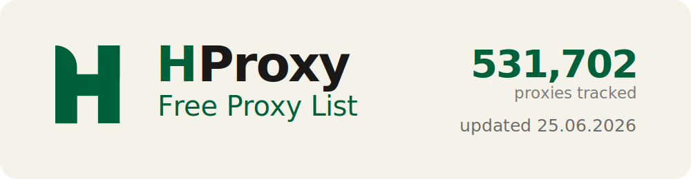

<p align="center">
  <a href="https://hproxy.com"></a>
</p>

<p align="center">
  <a href="https://hproxy.com"></a>
  <a href="https://hproxy.com/proxy-checker"></a>
  <a href="https://hproxy.com/residential"></a>
</p>

<p align="center"><b>14,277 free, live-checked proxies, updated every hour.</b><br>HTTP, HTTPS, SOCKS4 and SOCKS5, with country on every IP. 3,019 live right now, 363,674+ tracked all-time, updated 17.06.2026.</p>

## Download

| List | Proxies | Formats |
|------|--------:|---------|
| All | 14,277 | [txt](all.txt) &middot; [json](all.json) &middot; [csv](all.csv) |
| HTTP | 1,895 | [txt](http.txt) |
| HTTPS | 919 | [txt](https.txt) |
| SOCKS4 | 1,567 | [txt](socks4.txt) |
| SOCKS5 | 1,458 | [txt](socks5.txt) |

Text files are one `ip:port` per line. `all.json` and `all.csv` add protocol, anonymity, country, city, latency and uptime per proxy.

## Use as an API

Every file is a raw endpoint, refreshed hourly. Pull via GitHub raw or the jsDelivr CDN (faster, no rate limits):

```bash
# all proxies, three formats
curl https://raw.githubusercontent.com/hproxy-com/free-proxy-list/main/all.txt
curl https://raw.githubusercontent.com/hproxy-com/free-proxy-list/main/all.json
curl https://cdn.jsdelivr.net/gh/hproxy-com/free-proxy-list@main/all.csv
# filter by protocol or country
curl https://raw.githubusercontent.com/hproxy-com/free-proxy-list/main/socks5.txt
curl https://raw.githubusercontent.com/hproxy-com/free-proxy-list/main/by-country/US.txt
```

**Want real-time results with filters?** The files above are hourly snapshots. The live API at `https://hproxy.com/api/proxy-list` filters the current pool by country, protocol and anonymity:

```bash
curl "https://hproxy.com/api/proxy-list?format=json&country=US&protocol=socks5&anonymity=elite"
```

Full API docs: **https://hproxy.com/docs**

<details>
<summary><b>Free proxies by country</b> (115 countries)</summary>

| Country | Proxies | File |
|---------|--------:|------|
| Iran (IR) | 4,863 | [by-country/IR.txt](by-country/IR.txt) |
| United States (US) | 1,646 | [by-country/US.txt](by-country/US.txt) |
| Indonesia (ID) | 945 | [by-country/ID.txt](by-country/ID.txt) |
| China (CN) | 614 | [by-country/CN.txt](by-country/CN.txt) |
| India (IN) | 501 | [by-country/IN.txt](by-country/IN.txt) |
| Japan (JP) | 421 | [by-country/JP.txt](by-country/JP.txt) |
| Germany (DE) | 378 | [by-country/DE.txt](by-country/DE.txt) |
| Australia (AU) | 354 | [by-country/AU.txt](by-country/AU.txt) |
| South Korea (KR) | 347 | [by-country/KR.txt](by-country/KR.txt) |
| Hong Kong (HK) | 326 | [by-country/HK.txt](by-country/HK.txt) |
| France (FR) | 240 | [by-country/FR.txt](by-country/FR.txt) |
| Sweden (SE) | 212 | [by-country/SE.txt](by-country/SE.txt) |
| Russia (RU) | 211 | [by-country/RU.txt](by-country/RU.txt) |
| Thailand (TH) | 211 | [by-country/TH.txt](by-country/TH.txt) |
| Canada (CA) | 184 | [by-country/CA.txt](by-country/CA.txt) |
| Brazil (BR) | 176 | [by-country/BR.txt](by-country/BR.txt) |
| Switzerland (CH) | 174 | [by-country/CH.txt](by-country/CH.txt) |
| Philippines (PH) | 172 | [by-country/PH.txt](by-country/PH.txt) |
| United Kingdom (GB) | 158 | [by-country/GB.txt](by-country/GB.txt) |
| Singapore (SG) | 152 | [by-country/SG.txt](by-country/SG.txt) |
| South Africa (ZA) | 151 | [by-country/ZA.txt](by-country/ZA.txt) |
| Mexico (MX) | 142 | [by-country/MX.txt](by-country/MX.txt) |
| Bangladesh (BD) | 138 | [by-country/BD.txt](by-country/BD.txt) |
| Colombia (CO) | 121 | [by-country/CO.txt](by-country/CO.txt) |
| Ireland (IE) | 111 | [by-country/IE.txt](by-country/IE.txt) |
| Italy (IT) | 110 | [by-country/IT.txt](by-country/IT.txt) |
| Vietnam (VN) | 95 | [by-country/VN.txt](by-country/VN.txt) |
| Netherlands (NL) | 90 | [by-country/NL.txt](by-country/NL.txt) |
| Malaysia (MY) | 76 | [by-country/MY.txt](by-country/MY.txt) |
| United Arab Emirates (AE) | 63 | [by-country/AE.txt](by-country/AE.txt) |
| Turkey (TR) | 60 | [by-country/TR.txt](by-country/TR.txt) |
| Ecuador (EC) | 59 | [by-country/EC.txt](by-country/EC.txt) |
| Spain (ES) | 55 | [by-country/ES.txt](by-country/ES.txt) |
| Venezuela (VE) | 55 | [by-country/VE.txt](by-country/VE.txt) |
| Israel (IL) | 52 | [by-country/IL.txt](by-country/IL.txt) |
| Cambodia (KH) | 45 | [by-country/KH.txt](by-country/KH.txt) |
| Argentina (AR) | 44 | [by-country/AR.txt](by-country/AR.txt) |
| Finland (FI) | 38 | [by-country/FI.txt](by-country/FI.txt) |
| Poland (PL) | 33 | [by-country/PL.txt](by-country/PL.txt) |
| Ukraine (UA) | 30 | [by-country/UA.txt](by-country/UA.txt) |
| Peru (PE) | 28 | [by-country/PE.txt](by-country/PE.txt) |
| Chile (CL) | 24 | [by-country/CL.txt](by-country/CL.txt) |
| Egypt (EG) | 20 | [by-country/EG.txt](by-country/EG.txt) |
| DO (DO) | 20 | [by-country/DO.txt](by-country/DO.txt) |
| BG (BG) | 20 | [by-country/BG.txt](by-country/BG.txt) |
| Pakistan (PK) | 19 | [by-country/PK.txt](by-country/PK.txt) |
| Kazakhstan (KZ) | 16 | [by-country/KZ.txt](by-country/KZ.txt) |
| Georgia (GE) | 16 | [by-country/GE.txt](by-country/GE.txt) |
| Kenya (KE) | 16 | [by-country/KE.txt](by-country/KE.txt) |
| Taiwan (TW) | 15 | [by-country/TW.txt](by-country/TW.txt) |
| LY (LY) | 15 | [by-country/LY.txt](by-country/LY.txt) |
| Paraguay (PY) | 14 | [by-country/PY.txt](by-country/PY.txt) |
| Nepal (NP) | 13 | [by-country/NP.txt](by-country/NP.txt) |
| HN (HN) | 10 | [by-country/HN.txt](by-country/HN.txt) |
| Austria (AT) | 9 | [by-country/AT.txt](by-country/AT.txt) |
| Czechia (CZ) | 8 | [by-country/CZ.txt](by-country/CZ.txt) |
| Romania (RO) | 7 | [by-country/RO.txt](by-country/RO.txt) |
| EE (EE) | 7 | [by-country/EE.txt](by-country/EE.txt) |
| PR (PR) | 7 | [by-country/PR.txt](by-country/PR.txt) |
| Hungary (HU) | 7 | [by-country/HU.txt](by-country/HU.txt) |
| IQ (IQ) | 6 | [by-country/IQ.txt](by-country/IQ.txt) |
| Nigeria (NG) | 6 | [by-country/NG.txt](by-country/NG.txt) |
| AL (AL) | 6 | [by-country/AL.txt](by-country/AL.txt) |
| LV (LV) | 5 | [by-country/LV.txt](by-country/LV.txt) |
| UZ (UZ) | 5 | [by-country/UZ.txt](by-country/UZ.txt) |
| GT (GT) | 5 | [by-country/GT.txt](by-country/GT.txt) |
| GH (GH) | 5 | [by-country/GH.txt](by-country/GH.txt) |
| RS (RS) | 4 | [by-country/RS.txt](by-country/RS.txt) |
| AM (AM) | 4 | [by-country/AM.txt](by-country/AM.txt) |
| BW (BW) | 4 | [by-country/BW.txt](by-country/BW.txt) |
| SN (SN) | 4 | [by-country/SN.txt](by-country/SN.txt) |
| PS (PS) | 4 | [by-country/PS.txt](by-country/PS.txt) |
| XK (XK) | 4 | [by-country/XK.txt](by-country/XK.txt) |
| Belarus (BY) | 4 | [by-country/BY.txt](by-country/BY.txt) |
| Greece (GR) | 3 | [by-country/GR.txt](by-country/GR.txt) |
| TZ (TZ) | 3 | [by-country/TZ.txt](by-country/TZ.txt) |
| BO (BO) | 3 | [by-country/BO.txt](by-country/BO.txt) |
| QA (QA) | 3 | [by-country/QA.txt](by-country/QA.txt) |
| Belgium (BE) | 2 | [by-country/BE.txt](by-country/BE.txt) |
| LT (LT) | 2 | [by-country/LT.txt](by-country/LT.txt) |
| MD (MD) | 2 | [by-country/MD.txt](by-country/MD.txt) |
| LA (LA) | 2 | [by-country/LA.txt](by-country/LA.txt) |
| SY (SY) | 2 | [by-country/SY.txt](by-country/SY.txt) |
| ME (ME) | 2 | [by-country/ME.txt](by-country/ME.txt) |
| Saudi Arabia (SA) | 2 | [by-country/SA.txt](by-country/SA.txt) |
| CG (CG) | 2 | [by-country/CG.txt](by-country/CG.txt) |
| CD (CD) | 2 | [by-country/CD.txt](by-country/CD.txt) |
| PA (PA) | 2 | [by-country/PA.txt](by-country/PA.txt) |
| MT (MT) | 2 | [by-country/MT.txt](by-country/MT.txt) |
| TM (TM) | 1 | [by-country/TM.txt](by-country/TM.txt) |
| Norway (NO) | 1 | [by-country/NO.txt](by-country/NO.txt) |
| MW (MW) | 1 | [by-country/MW.txt](by-country/MW.txt) |
| RW (RW) | 1 | [by-country/RW.txt](by-country/RW.txt) |
| AZ (AZ) | 1 | [by-country/AZ.txt](by-country/AZ.txt) |
| BA (BA) | 1 | [by-country/BA.txt](by-country/BA.txt) |
| UY (UY) | 1 | [by-country/UY.txt](by-country/UY.txt) |
| CY (CY) | 1 | [by-country/CY.txt](by-country/CY.txt) |
| WS (WS) | 1 | [by-country/WS.txt](by-country/WS.txt) |
| MM (MM) | 1 | [by-country/MM.txt](by-country/MM.txt) |
| BI (BI) | 1 | [by-country/BI.txt](by-country/BI.txt) |
| LS (LS) | 1 | [by-country/LS.txt](by-country/LS.txt) |
| MO (MO) | 1 | [by-country/MO.txt](by-country/MO.txt) |
| CR (CR) | 1 | [by-country/CR.txt](by-country/CR.txt) |
| LK (LK) | 1 | [by-country/LK.txt](by-country/LK.txt) |
| SC (SC) | 1 | [by-country/SC.txt](by-country/SC.txt) |
| Portugal (PT) | 1 | [by-country/PT.txt](by-country/PT.txt) |
| BF (BF) | 1 | [by-country/BF.txt](by-country/BF.txt) |
| HR (HR) | 1 | [by-country/HR.txt](by-country/HR.txt) |
| AO (AO) | 1 | [by-country/AO.txt](by-country/AO.txt) |
| LB (LB) | 1 | [by-country/LB.txt](by-country/LB.txt) |
| AF (AF) | 1 | [by-country/AF.txt](by-country/AF.txt) |
| UG (UG) | 1 | [by-country/UG.txt](by-country/UG.txt) |
| GQ (GQ) | 1 | [by-country/GQ.txt](by-country/GQ.txt) |
| KG (KG) | 1 | [by-country/KG.txt](by-country/KG.txt) |
| YE (YE) | 1 | [by-country/YE.txt](by-country/YE.txt) |

</details>

## Powered by HProxy

Free proxies die fast and are often already blocked. For proxies that stay up, [**HProxy**](https://hproxy.com) does residential, ISP, mobile and datacenter, billed by the gigabyte, from $0.99/GB.

[Live list](https://hproxy.com/free-proxy-list) &nbsp;&middot;&nbsp; [Proxy checker](https://hproxy.com/proxy-checker) &nbsp;&middot;&nbsp; [Pricing](https://hproxy.com/residential)

## Contributing

Raw IPs cannot be added by pull request (the list regenerates hourly). Instead, [suggest a proxy source](CONTRIBUTING.md), or feed proxies through the [free checker](https://hproxy.com/proxy-checker), which adds verified proxies to the pool automatically.

## Legal

These proxies are aggregated from publicly available sources. We do not scan, port-scan or collect them ourselves, and we store nothing about the devices behind them. They are provided as-is, with no warranty, for lawful use only. You are responsible for how you use them: follow the GitHub Acceptable Use Policy and your local laws, and never route passwords or sensitive data through a public proxy. If an IP address is yours and you want it removed, open an issue.

<p align="center"><sub><a href="https://hproxy.com">hproxy.com</a> &nbsp;&middot;&nbsp; auto-updated hourly &nbsp;&middot;&nbsp; 2026-06-17 02:07 UTC</sub></p>
